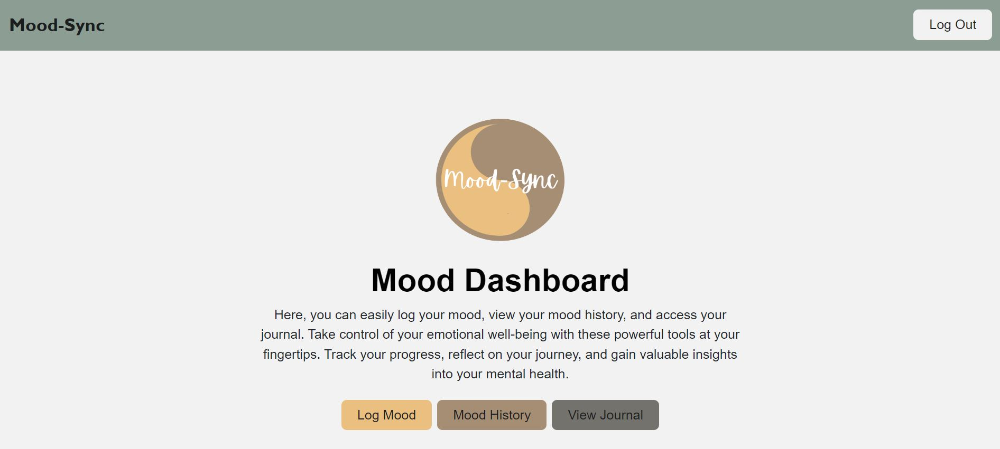

# Mood-Sync

## Description
This is an application used to track patterns in a users mental health.

## Table of Contents
- [Installation](#installation)
- [Usage](#usage)
- [Credits](#credits)
- [License](#license)
- [How to Contribute](#how-to-contribute)
- [Tests](#tests)

## Installation
This project does not require an installation. However, you are welcome to to either clone the repository and access the project files or fork the repo.

## Usage
Deployed on [Render](https://moodsync-f64p.onrender.com/)

## Credits
-Manuel Pena
-Michael Duffey
-Erica Acosta
-Gabriel Salazar
-Andres Albornoz

## License
MIT License.

## How to Contribute
We are currently not looking for contributors.

## Tests
Tested at the time of deployment.
